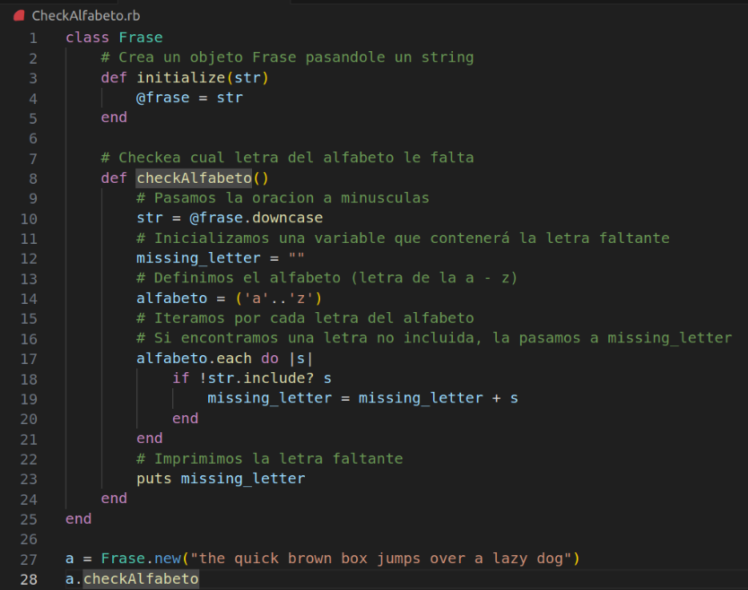
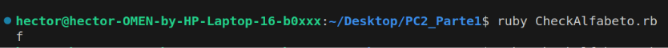
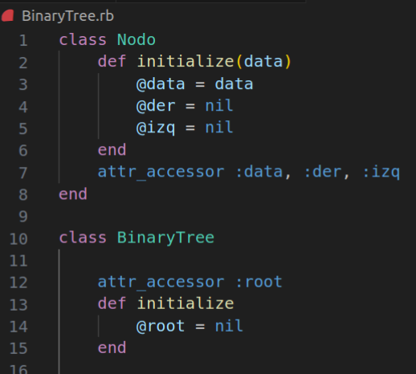
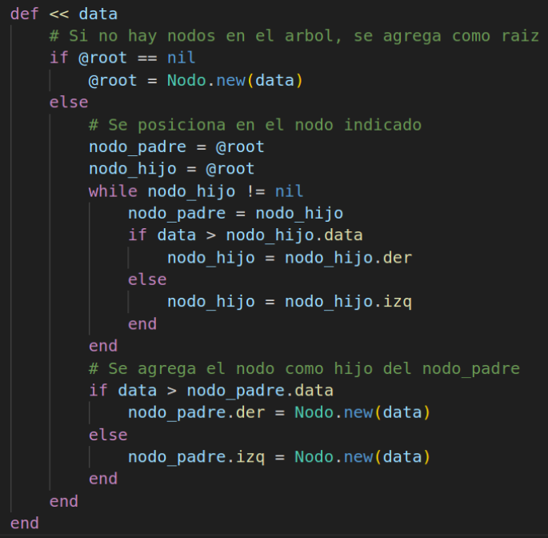
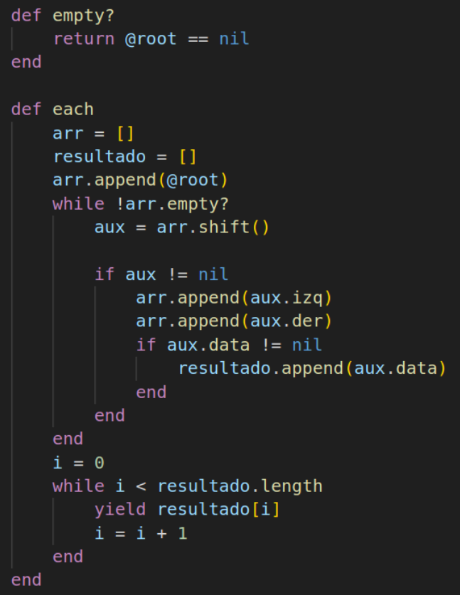
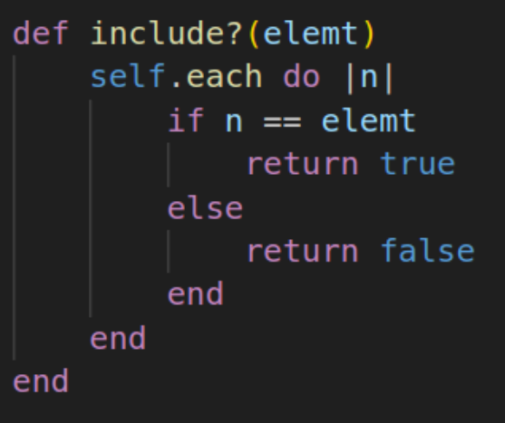

# CheckAlfabeto.rb
Creamos una clase Frase, que se inicializara haciendole pasar un string, que será la oracion con la que trabajaremos. 
Para encontrar la letra faltante, primero definimos en la variable "alfabeto" un arreglo con todas las letras que van desde la 'a' hasta la 'z'. Estas son letras minusculas, asi que para hacer la comparación tendremos que pasar la variable @frase a minusculas. Luego iteramos por cada letra del alfabeto, y si encontramos una que no esta contenida en @frase, entonces guardamos esta letra en la variable missing_letter. Finalmente imprimimos missing_letter.

# BinaryTree.rb 

Para crear un arbol binario, definimos dos clases: Nodo y BinaryTree. Cada nodo tendra tres atributos: la data que se quiera guardar, y dos referencias a un nodo derecho y uno izquierda. Un objeto BinaryTree tendra como unico atributo su raiz o root.

Para definir la funcion << que se encargará de insertar valores en el árbol. Primero verificamos que el árbol tenga raiz, en caso no la tenga agregamos el nuevo nodo directamente pues el árbol está vacio. Si el árbol si presenta raíz, entonces iteramos sobre los nodos (hacia la derecha si es mayor que, hacia la izquierda si es menor que) hasta llegar al último nivel posible. Es entonces cuando insertaremos un nuevo nodo (a la izquierda o a la derecha segun sea el caso). 

La funcion empty? Verifica si la raiz es nula, si ese fuera el caso entonces el árbol estaría vacío y devolvería True, en caso la raíz no fuera nula entonces el árbol estaría no vacío y la función devolvería False. 
Para la función each decidí iterar sobre los elementos del árbol en orden de profundidad (primero la raíz, luego sus hijos, luego los hijos de los hijos, y así sucesivamente). Para esto defini dos arreglos: arr y resultado. En arr iremos almacenando los nodos del arbol, partiendo desde la raiz; en cada iteración se ira removiendo el primer elemento del arreglo, y se agregaran los hijos del nodo recién removido al array. Se seguirá este proceso hasta que el array esté vacío. Si el dato asociado al nodo removido es no nulo, se agrega su dato al arreglo de resultados. Últimamente, con el arreglo de resultados ya listo, los retornamos usando yield, pues queremos que la función pueda aceptar bloques. 

Para la funcion include, iteramos sobre todos los elementos del arbol con nuestro recien creado método each. Si se encuentra una coincidencia entre uno de los elementos del arbol y el argumento de la funcion include? Entonces retornamos True, si no ocurre ninguna coincidencia entonces retornamos False. 

