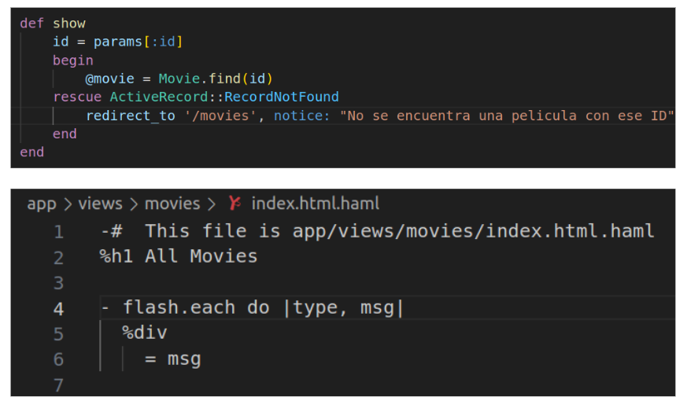
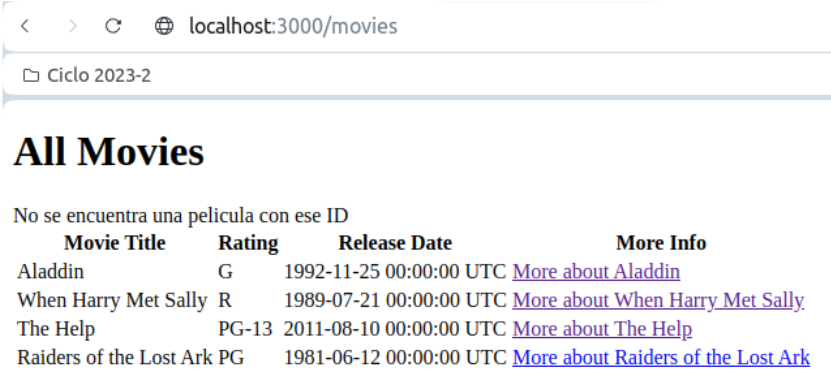

# Error para 'movies/9999'
Para evitar que se muestre la pantalla de error de Rails, realizamos los siguientes cambios. 

En el método show del controlador de Movies recuperamos el error del tipo ActiveRecord::RecordNotFound con las clausulas Begin – Rescue. En caso encontremos uno de estos errores, hacemos una redireccion a '/movies' y pasamos con flash un mensaje de error (notice). Sin embargo, pasar el mensaje de error no significa que se vaya a mostrar al usuario, para esto debemos modificar la vista a la que estamos redirigiendo, en este caso index.html.haml 

Ahora si intentamos visitar localhost:3000/movies/9999 desde el navegador, nos redigirá a la página de inicio mostrando un nuevo mensaje debajo del header All Movies. 

