# Nueva aplicacion Rails
Despues de crear un nuevo proyecto de Rails, creamos una migración inicial. Las migraciones nos ayudan a transferir datos entre bases de datos con esquemas (estructura) diferente, pero en esta oportunidad nos servirá para crear una tabla inicial, en este caso una tabla Movies 

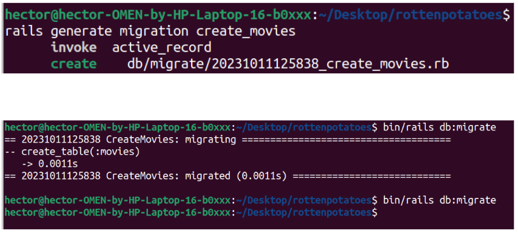

Luego, usando la consola de Ruby podemos confirmar que se ha creado la tabla con las columnas que se especificaron en el archivo <timestamp>_create_movies.rb. Observamos que la tabla esta vacia (Movie.first nos devuelve nil) 

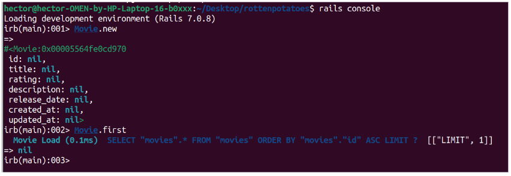

Al momento de crear una tabla podemos tambien pasar datos iniciales para tener una base sobre la cual trabajar. Esto se realiza con el comando rake db:seed. Previamente en el archivo seeds.rb se deben haber definido los datos a insertar. Nuevamente podemos confirmar que se hizo el seed correctamente mediante la consola Ruby. 

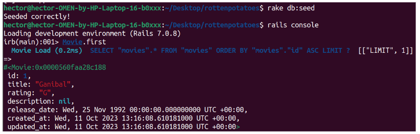

Ahora, una vez ejecutamos el comando bin/rails server, podemos visitar nuestra aplicacion en el navegador web, en localhost:3000, pero podemos observar si intentamos ir a localhost:3000/movies, nos arrojará un error, pues no hemos definido una ruta para "movies".

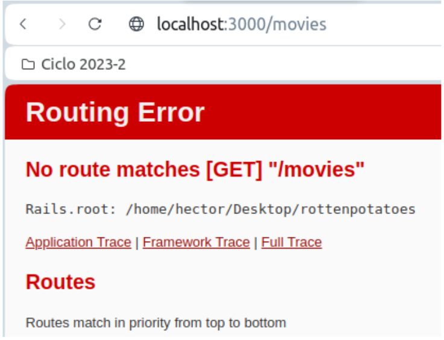

Esto lo podemos ver tambien en el archivo development.log 

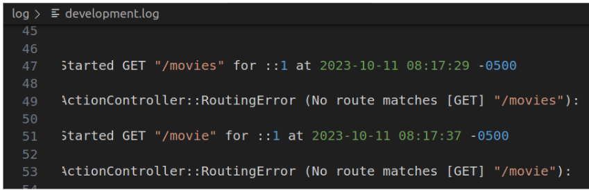

Para subsanar el error, agregamos una ruta para movies en el archivo routes.rb 

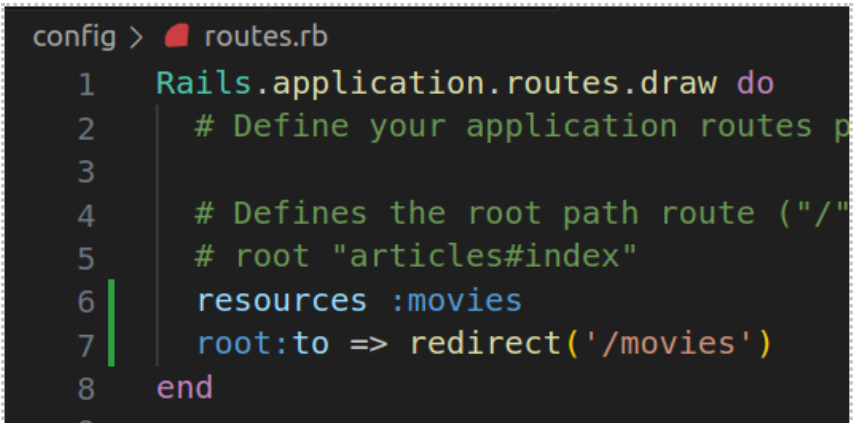

Si ejecutamos el comando rails routes podemos verificar que esta ruta se agregó correctamente. 

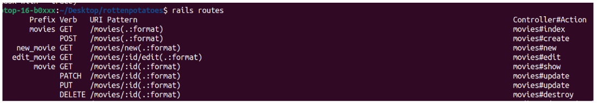

Ahora si visitamos localhost:3000/movies, nos sigue arrojando error, pero ahora es un error distinto: Constante no inicializada MoviesController. Esto es porque no hemos definido un controlador para Movies.  

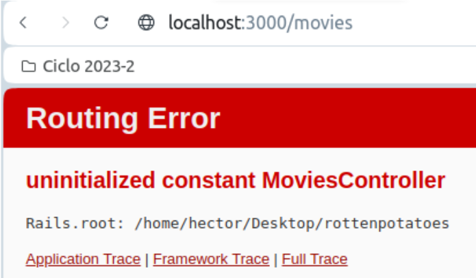

Usando rails generate scaffold_controller podremos generar un controlador para Movies que incluye unos métodos por defecto, así como vistas para cáda método. 

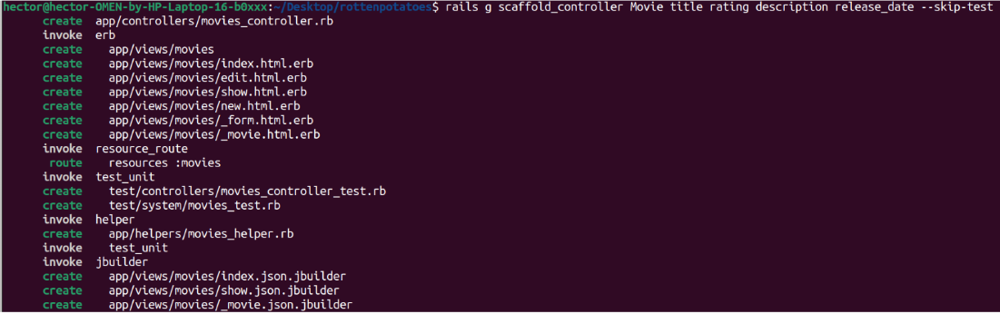

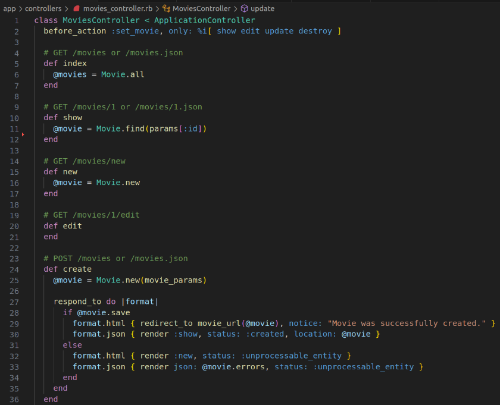

Mientras el programa corre de manera satisfactoria en el entorno local, después de desplegarlo a Heroku encuentro un error que hasta el momento no he sabido solucionar.  

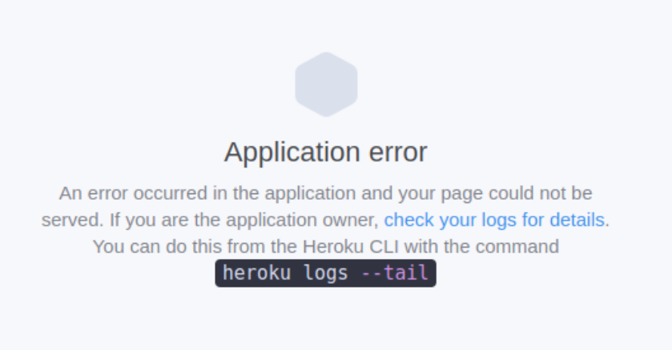

En los logs de Heroku: 

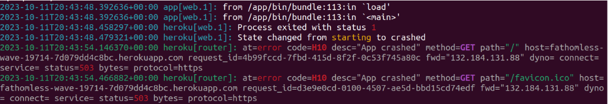
